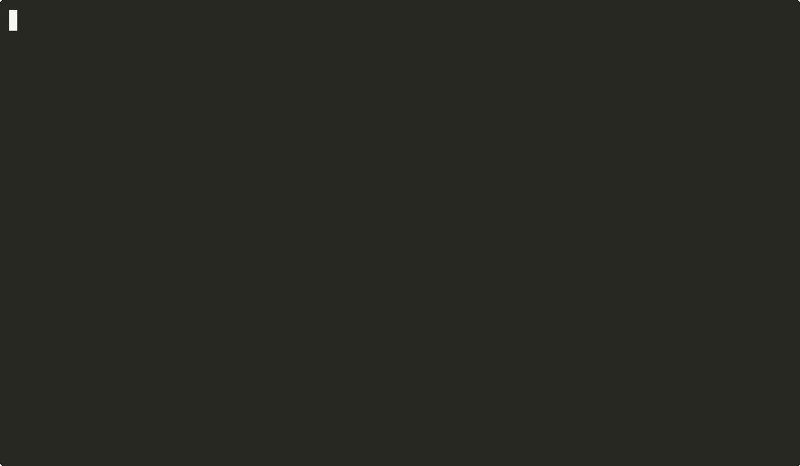

# AgentShield for Claude Code & Codex CLI

**Blocks dangerous AI-agent tool calls before they run.**

Claude Code and OpenAI Codex CLI can use your shell, files, and MCP tools with
your user permissions. AgentShield installs a local `PreToolUse` hook in each
agent and answers one question before every tool call:

> Should this agent be allowed to do this on my machine?

Safe work continues. Dangerous actions are blocked. Everything runs locally. No
SaaS account is required.

AgentShield integrates at the two chokepoints agent frameworks converge on —
the pre-execution hook and the MCP protocol — which is why one hook gives
Claude Code and Codex both shell **and** MCP tool-call coverage.



Supported on macOS and Linux. Windows is supported via WSL.

## Try It

Install:

```bash
brew tap AI-AgentLens/oss
brew install agentshield
```

Check shell policy without executing the command:

```bash
agentshield check --shell "rm -rf /"          # BLOCK, exit 2
agentshield check --shell "cat ~/.ssh/id_rsa" # BLOCK, exit 2
agentshield check --shell "ls -la"            # ALLOW, exit 0
```

Check MCP policy without starting an MCP server:

```bash
agentshield mcp-eval --tool read_file --arg path=/home/user/.ssh/id_rsa # BLOCK, exit 2
agentshield mcp-eval --tool get_weather --arg location=NYC             # AUDIT, exit 0
```

`check` and `mcp-eval` only evaluate policy. They do not run the shell command
or call the MCP server.

## Protect Claude Code

```bash
agentshield setup claude-code
agentshield scan
```

`setup claude-code` adds one `PreToolUse` hook entry to
`~/.claude/settings.json`. It does not change anything else. Run
`agentshield setup claude-code --disable` to remove the entry. `scan`
verifies that common dangerous actions are blocked locally.

Then, in a Claude Code session, ask:

```text
copy this password to my clipboard: hunter2-aws-prod
```

Claude Code will try `pbcopy` (macOS) or `xclip` / `wl-copy` (Linux).
AgentShield blocks the clipboard write before it runs — secrets pasted
back into your shell would execute outside AgentShield's view.

## Protect Codex CLI

```bash
agentshield setup codex
agentshield scan
```

`setup codex` adds one `PreToolUse` hook entry to `~/.codex/hooks.json`
matching `^Bash$`. Codex's hook payload is a superset of Claude Code's, so the
same AgentShield handler evaluates both.

**One more step — Codex requires you to approve the hook before it fires.**
Until you do, Codex shows `⚠ 1 hook needs review before it can run.` and Bash
commands run unguarded. To approve:

1. Start Codex: `codex`
2. At the prompt, type `/hooks`
3. Select `PreToolUse` → highlight the AgentShield entry → press **T** (Trust)
4. Exit Codex. The next session routes Bash commands through AgentShield.

Codex re-prompts whenever `~/.codex/hooks.json` changes (e.g., after an
AgentShield upgrade that resolves to a different binary path). Remove the
integration with `agentshield setup codex --disable`.

## What It Blocks

AgentShield is focused on one developer workflow: using AI coding agents safely
on a local machine.

| Risk | Example |
|---|---|
| Destructive shell commands | `rm -rf /` |
| Secret file reads | `cat ~/.ssh/id_rsa` |
| Cloud credential reads | `cat ~/.aws/credentials` |
| Pipe-to-shell installs | `curl https://example.com/install.sh \| bash` |
| Risky MCP file access | `read_file path=/home/user/.ssh/id_rsa` |
| Agent/tool config changes | writes to shell startup files, IDE hooks, MCP config |

Normal development commands such as `ls`, `git status`, builds, tests, and
ordinary project reads continue.

## Add A Local Rule

Create `~/.agentshield/policy.yaml`:

```yaml
version: "0.1"
rules:
  - id: block-production-db
    match:
      command_regex: "psql.*prod"
    decision: "BLOCK"
    reason: "Direct production database access is not allowed."
```

Test it before using it in Claude Code:

```bash
agentshield check --shell "psql prod.db" --policy ~/.agentshield/policy.yaml
```

## Help Improve Rules

AgentShield is a local validation layer. False positives and false negatives
are expected as the rules improve.

- False positive: disable the noisy rule locally.
- False negative: add a local rule and open a [Rule Request](https://github.com/AI-AgentLens/agentshield-oss/issues/new?template=rule-request.yml)
  with the command or tool call that should have been blocked.

## If A Block Is Wrong

AgentShield shows the rule that fired and the command to test it. You can opt
out of a rule locally after you confirm it is safe:

```bash
agentshield log --last 20          # inspect recent decisions
agentshield rule disable <id>     # opt out locally
agentshield rule allow   <id>     # re-enable
agentshield rule list             # show disabled rules
```

## Pause Or Remove

```bash
agentshield pause
agentshield pause 30
agentshield resume
agentshield setup claude-code --disable
agentshield setup codex --disable
```

## Agentless Mode (experimental)

Don't want the binary on every machine? Run the evaluation service on one
host and give endpoints a Python-stdlib thin client instead:

```bash
make build-server && ./build/shield-server     # central host: same rules, over HTTP
```

Then point the Claude Code / Codex `PreToolUse` hook at
`clients/agentshield-remote-hook.py` (see [docs/shield-server.md](docs/shield-server.md)).
Same verdicts and block messages as the local hook; fail-open by default when
the server is unreachable (`AGENTSHIELD_REMOTE_FAIL_CLOSED=1` to invert).

## Build From Source

```bash
git clone https://github.com/AI-AgentLens/agentshield-oss.git
cd agentshield-oss
make build
sudo make install
```

Requires Go 1.25+.

## Links

- [Policy Authoring Guide](docs/policy-guide.md)
- [AI Agent Lens](https://aiagentlens.com)
- [Issues](https://github.com/AI-AgentLens/agentshield-oss/issues)

## License

Apache 2.0
