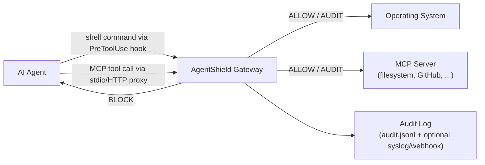
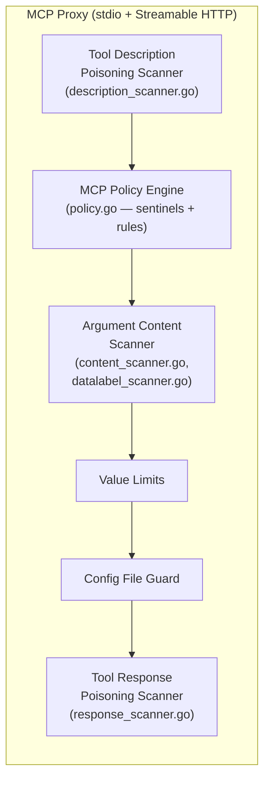

# AgentShield Architecture

> **Reading time:** ~5 minutes. This doc is a single-pass overview that captures the invariants, tradeoffs, and intentional deferrals so a reviewer can validate architectural design against the code without reading every package. If something here disagrees with the code, the code wins — please update this doc in the same PR.

## Mission

AgentShield is a **local-first runtime security gateway** between AI coding agents (Claude Code, Cursor, Windsurf, Codex, Gemini CLI) and the operating system. It mediates two channels — **shell commands** and **MCP tool calls** — by *evaluating* every request against a layered analyzer pipeline before forwarding. It does not execute or wrap the eventual command; the IDE PreToolUse hook is the integration point. Default decision is **AUDIT** (fail-safe).

## Two channels



Both channels share the same audit/redaction pipeline and rule-pack tiers. They have **separate evaluation pipelines** (different signal models): shell uses the 7-layer analyzer; MCP uses the proxy scanners.

These two channels are the integration thesis: they are the **chokepoints
every agent framework converges on**, so AgentShield integrates per-protocol,
not per-framework. A harness reaches the shell channel through a thin payload
adapter (five dialects live in `internal/cli/hook.go`; agentless variants in
`clients/` delegate to shield-server), and reaches the MCP channel either
natively through the same hook (Claude Code, Codex) or via the
harness-agnostic proxy, which wraps any MCP server without the harness's
cooperation. Adding a framework is an adapter, not a rebuild. The honest
claim boundary: "anything that speaks MCP can be mediated" holds without
qualification; shell support is enumerated per-harness (see the README
support matrix — Windsurf and Gemini CLI have no MCP interception today).

## Shell pipeline (7 detection layers + Layer 2.5 enrichment)

| # | Layer | Source | Catches |
|---|-------|--------|---------|
| 1 | Regex | `internal/analyzer/regex.go` | exact patterns (`rm -rf /`, `curl \| bash`) |
| 2 | Structural | `internal/analyzer/structural.go` | shell AST via `mvdan.cc/sh`, flag normalization, sudo unwrapping, pipes |
| **2.5** | **Substitution** | **`internal/analyzer/substitution.go`** | **constant propagation through `Name=value` assignments + constant-decoder pipeline folding (#1699). Returns no findings — enriches `ctx.MaterializedPaths` for the engine to re-check. Defeats split-concat bypasses like `P1=~/.ssh; P2=id_rsa; cat $P1/$P2` and constant base64-decoder shapes like `cat $(echo b64 \| base64 -d)`.** |
| 3 | Semantic | `internal/analyzer/semantic.go` | intent classification (file-delete, network-exfil, code-execute) |
| 4 | Dataflow | `internal/analyzer/dataflow.go` | source→sink taint through pipes/redirects |
| 5 | Stateful | `internal/analyzer/stateful.go` | multi-step chain detection within a single compound command |
| 6 | Guardian | `internal/guardian/heuristic.go` | prompt injection, obfuscation, inline secrets, eval/exec risk, unicode steganography |
| 7 | Data Label | `internal/analyzer/datalabel.go` | customer-defined PII / codenames (4-tier engine, conditional) |

Pre-pipeline: `internal/normalize/normalize.go` extracts the executable, args, paths, and domains and pre-parses the AST. Post-decision: `internal/redact/` redacts secrets from the audit-event command/args/error before persisting.

The combiner uses **most-restrictive-wins**: `BLOCK > AUDIT > ALLOW`. If the pipeline produces no findings and no rules match, the engine falls through to the default decision (AUDIT) with a `protected_paths` override (BLOCK if path matches — including any path materialized by Layer 2.5).

### Invariants (pipeline)

- **Pipeline is fail-safe**: any analyzer panicking returns AUDIT, never crashes the host.
- **Stateful is intra-command-only in production** — `internal/policy/pipeline.go` calls `NewStatefulAnalyzer(nil)`. The `SessionStore` interface exists but no production code calls `Record()`. Cross-command session state is **not** an active surface; treat it as deferred (see #19, deferred MCP cross-tool taint).
- **Layer 2.5 returns no findings** — pure context enrichment via `ctx.MaterializedPaths`. The engine re-checks materialized paths against `protected_paths` *after* the pipeline runs. Anything that makes Layer 2.5 produce a Finding directly is wrong; if it needs a Finding, it belongs in Structural / Semantic / Guardian.
- **Layer 2.5 ↔ Guardian boundary**: constant decoder pipelines (e.g. `cat $(echo b64 | base64 -d)`) are Layer 2.5's job — folded deterministically. *Non-constant* decoder shapes (CmdSubst with unresolved source, ParamExp Layer 2.5 couldn't resolve) are flagged AUDIT by Guardian's `obfuscated_decoder_eval` signal. Keeping the constant-emitter list in `internal/guardian/decoder_audit.go` in sync with `evalConstSource` in `internal/analyzer/substitution_decoder.go` is what makes the split work — see the comments in `decoder_audit.go`.
- **DataLabel is zero-cost when disabled** — `NewEngine` returns nil when `data_labels` is empty, the analyzer is not registered.
- **Combiner contract**: never downgrade a finding (no AUDIT-overrides-BLOCK paths anywhere).

### Pipeline flow

```mermaid
flowchart LR
  Cmd["Raw Command"]
  Norm["Normalize\n(pre-pipeline)"]
  R["1. Regex"] --> S["2. Structural"] --> Sub["2.5 Substitution\n(enrichment, no findings)"] --> Sem["3. Semantic"] --> DF["4. Dataflow"] --> SF["5. Stateful"] --> G["6. Guardian"] --> DL["7. DataLabel"]
  Cmd --> Norm --> R
  DL --> Comb["Combiner\n(most-restrictive-wins)"] --> ProtPath["Re-check\nprotected_paths\n(incl. materialized)"] --> Dec["Decision\nBLOCK / AUDIT / ALLOW"]
  Dec --> Redact["Redact\n(audit-log only)"]
```



## MCP mediation



- **Description scanner** runs at `tools/list` (definitions). Rule pack: `mcp-tool-poisoning`, `mcp-sentinel`.
- **Content scanner** runs at every `tools/call` (arguments).
- **Response scanner** runs at every `tools/call` *response* and `resources/read` response — six injection-class signals plus position-aware tail check for truncation smuggling (#1764) and reasoning-mimicry framing (#1765).
- **Sentinel pattern**: rules backed by Go detection engines have `engine: <name>` in YAML and provide identity/taxonomy/reason metadata only. Detection runs in `internal/mcp`, audit log gets the rule ID via `LookupSentinel`. Used for cross-server state, deep content analysis, anything that can't be a YAML pattern match.

## Rule packs

```
packs/
├── community/                # OSS, embedded into binary
│   ├── *.yaml                # shell rules (~1100 today)
│   └── mcp/*.yaml            # MCP rules (community)
└── premium/                  # paid tier, delivered via SaaS API
    ├── *.yaml                # shell rules (semantic/dataflow/stateful)
    ├── mcp/*.yaml            # MCP rules including mcp-sentinel.yaml
```

**Embedded packs are authoritative.** `//go:embed community/*.yaml` ships the OSS coverage — a fresh install needs zero disk packs. Disk packs (`~/.agentshield/packs/`) layer on top: `agentshield update` fetches premium YAML from the SaaS API and writes to disk; user custom packs go alongside. The fitness function `internal/policy/embedded_packs_test.go` protects against the old broken design where install code wrote community packs to disk.

Loading order: embedded → `~/.agentshield/packs/` → CLI `--policy` override (ignored in managed mode).

## FP-aware design

Today's session surfaced the meta-pattern: **a security tool that punishes its own builders gets resisted by the team that has to live with it.** Specific design moves to mitigate this, all in `internal/guardian/heuristic.go`:

- **Safe-caller stripping**: `gh`/`git` commands strip quoted arguments before pattern-matching (`safeCallerRe` + `stripQuotedRe`). Commit messages, PR bodies, issue text are sent to external APIs, not executed.
- **Heredoc-then-quote ordering** (#1769): on the safe-caller path, truncate at `<<` *before* `stripQuotedRe`. Heredoc bodies inside `$(cat <<'EOF' ... EOF)` substitutions can have unbalanced quotes — strip-quoted alone misaligns and leaks the body.
- **Python `-c "..."` string-literal stripping**: the eval_risk strip removes triple-quoted (`'''...'''`, `"""..."""`), single-quoted (`'...'`), and shell-escaped double-quoted (`\"...\"`) string contents from inside `python3 -c "..."` arguments before checking for live `eval(`/`exec(` calls. Issues #1463, #1693, #1766.
- **File-write heredoc body stripping**: `cat > file << EOF ... EOF` and `tee file << EOF ... EOF` patterns strip the body — it's file content, not commands. Issues #233, #389.
- **Compound-segment evaluation**: commands joined by `&&`/`||`/`;` are split and each segment evaluated independently against its analyzer's safe-caller rules. `cd dir && gh pr create --body "..."` is correctly handled.

The eval_risk regression suite (`heuristic_test.go::TestHeuristicProvider_EvalRisk_GitCommitFP`) pins all of these. Adding a new safe-caller (e.g. `aws`, `gcloud`) requires extending the strip pattern AND adding TN cases for each documented issue (#184, #233, #389, #1463, #1690, #1766, #1768).

## Enterprise tamper-protection

`internal/enterprise/` adds a middleware chain to `evaluateCommand()` when `~/.agentshield/managed.json` has `"managed": true`. In non-managed mode the chain is empty (zero overhead).

| Middleware | Stage | Purpose |
|------------|-------|---------|
| `BypassGuard` | pre-eval | ignores `AGENTSHIELD_BYPASS=1` |
| `SelfProtect` | pre-eval | blocks 6 hardcoded patterns targeting AgentShield itself (config delete, hook delete, binary replace, policy write, setup --disable, env-var bypass) |
| `FailClosed` | post-eval | ensures errors return AUDIT, never ALLOW |
| `RemoteLog` | post-eval | async webhook fan-out (fire-and-forget with retry) |

A watchdog runs as a separate process (`agentshield watchdog`) for tamper detection on the binary + config.

## Dogfooding loop (Baby Kai)

Three Sonnet specialists (Shield, Comply, Taxonomy) plus an Opus Supervisor and Remedy verifier run nightly and on Sundays for an Opus deep-dive. They develop rules, run accuracy tests, and **self-merge their own PRs**. Every FP in their flow is a real signal — caught during real work, not synthesized — and the squad files rule-request issues against itself when blocked.

The CLAUDE.md "AgentShield QA Dogfooding" rule applies: every block during real workflow gets evaluated as TP/FP, and FPs become issues. Today's #1766/#1768/#1769/#1771 are all dogfood findings from this loop.

## Fitness functions

Every entry below was mutation-tested on 2026-07-28 (#3130 follow-up): the
defect each one claims to catch was introduced, the gate was confirmed to fail,
and the defect reverted. A gate that cannot fail is worse than no gate — it
launders an unverified claim into a green check, which is exactly what
`scripts/integration-test-oss.sh` did for months. Where a gate is cheap to
self-test, that test is checked in next to it (`*_test.sh`) and runs in CI.

| Test / target | Protects |
|---------------|---------|
| `make check-rule-coverage` (CI) | every taxonomy ref has TP+TN test data; baseline at `cmd/check-rule-coverage/baseline.txt`, exceptions need Gary+Kai sign-off |
| `make mcp-verify` (CI) | every MCP rule has scenario coverage (TP+TN). Wired into CI 2026-07-28 — it had been documented as a fitness function since #2193 but nothing ever ran it |
| `scripts/check-oss-baseline.sh` (nightly) | the OSS-stripped build does not lose coverage. Ratchets against `scripts/oss-known-failures.txt`; self-tested by `check-oss-baseline_test.sh`. See `.github/workflows/oss-distribution.yml` for why it is nightly and not a merge gate |
| `scripts/check-taxonomy-refs.sh` (CI) | no pack references a taxonomy id that has not landed in AI_risk_compliance; self-tested by `check-taxonomy-refs_test.sh` |
| `scripts/check-community-additions.sh` (CI) | no net-new rule under `packs/community/` without the `approved-community` label; self-tested by `check-community-additions_test.sh` |
| `internal/analyzer/parity_baseline_test.go::assertProbeNotVacuous` | the glob/brace parity sweeps use a production transform as their own validity gate, so a dead transform used to make them pass over an empty probe (`0/0 leaked`). The floor makes that state loud |
| `internal/policy/embedded_packs_test.go` | fresh install has full community coverage with zero disk packs (no install-time writes to `~/.agentshield/packs/`) |
| `make test-premium` | premium pack download + scan flow end-to-end |
| `internal/guardian/heuristic_test.go::TestHeuristicProvider_EvalRisk_GitCommitFP` | FP-aware strip patterns survive future edits |
| `cmd/check-rule-coverage/main.go` | annotation-driven TP/TN coverage walks the test corpus (`internal/analyzer/testdata/*.go`) |
| `internal/policy/pipeline_perf_test.go::TestPipelinePerfBudget` | per-tier P95 latency budget (typical < 5ms, adversarial < 100ms) against the embedded-community ruleset. `BenchmarkPipelinePerCommand` in the same file produces benchstat-comparable per-case timings. Calibrated 2026-05-03 — fails CI if a future rule/pipeline change degrades latency past budget. |

## Anti-patterns to avoid

- **Don't** embed `MITRE `, `OWASP `, `CWE-`, or `LLM0x` text in rule `message:` fields. Compliance is resolved from the `taxonomy:` ref at scan time. (See `AI_risk_compliance/CLAUDE.md` Rule Metadata Convention.)
- **Don't** write community packs to `~/.agentshield/packs/` on install. The embedded-packs invariant is the fitness-function-protected design (#1366 was the broken pre-2026-04 shape).
- **Don't** introduce a new MCP rule referencing a taxonomy ref that doesn't yet exist in `AI_risk_compliance/main`. The `Taxonomy refs` CI check sparse-clones AI_risk_compliance and fails closed. Cross-repo ordering: file the taxonomy entry PR first, merge it, *then* land the rule PR.
- **Don't** add cross-command session state without wiring `SessionStore.Record()` at the engine entry point. The interface's existence does not imply an active surface — it's deferred.
- **Don't** add a rule that fires on `git commit -m`/`gh pr create --body`/`gh issue create --body` content without going through the safe-caller strip chain. Every such rule that ignores it adds a FP class to the dogfooding queue.

## Intentionally deferred

These exist as ports/scaffolds but are not active production surfaces. Re-activating any of them is an architectural decision, not a bug fix.

| Surface | Status | Tracking |
|---------|--------|----------|
| Cross-command session state | `SessionStore` interface defined, never recorded in production | (no specific issue; see #19 for related MCP cross-tool taint design) |
| MCP cross-tool taint tracking (Phase 4) | design-only | #19 |
| Stratified confidence model with FP-budget fitness function | design-only | #1581 |
| Command-intent pre-classifier (replace `{{DOC_CONTEXT}}` macro sprawl) | design-only | #1580 |
| Google A2A protocol scanning support | strategic | #342 |

If you find code that looks like one of these is partially implemented but unreachable, that's expected — it's a sacrificial scaffold awaiting a concrete need to drive the full implementation.

---

*Last refreshed 2026-05-03 alongside the #1768 misdiagnosis investigation. If you're updating Shield architecture, please update this doc in the same PR — staleness is what got us into the #1768 loop in the first place.*
